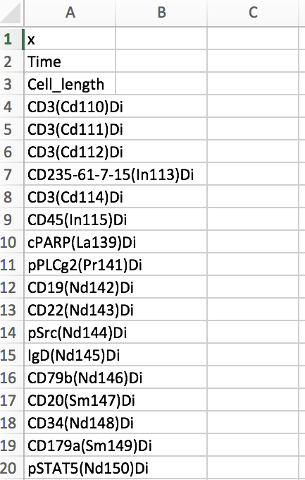
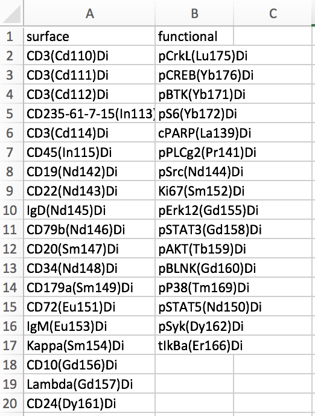

```{r setup, include=FALSE}
knitr::opts_chunk$set(echo = TRUE, results = "markup", message = FALSE, warning = FALSE)
```

### TL:DR:  
You will use get.marker.names() to obtain properly named markers as a column in a csv saved to your computer. In this csv, you will make two columns, one for markers you want as input for knn, and one for markers you want to make your scone comparisons on. You will read this back into R to access these markers as vectors of strings. You'll then run process.multiple.files() to get your subsampled, concatenated matrix ready for KNN computation. 

## ABOUT PRE-PROCESSING 

### Introduction:  
Fluorescence and mass cytometry data are routinely processed by an increasing array of software platforms. Many of these contain graphical user interfaces, and many of these are R packages. However, no two analyses are the same, and many cases may involve direct processing of files in R. The Sconify package provides a suite of functions to make this process simpler and more user-friendly, prior to the knn-centric analysis occurring downstream. In essence, these functions convert fcs files into data matrices, process these matrices, and can output said matrices into fcs files readable by additional software. Although the primary intent of these functions is to pre-process fcs files for use of k-nearest neighbor statistics and visualizations in the remainder of this package, they are intended also to be general use functions. 

### Data:   
We will be using the Wanderlust dataset through this series of vignettes. (paper: https://www.ncbi.nlm.nih.gov/pubmed/24766814, dataset: https://www.c2b2.columbia.edu/danapeerlab/html/wanderlust-data.html). We show a particular donor (labeled Sample C), with B cell precursors at the basal state, and stimulated with IL-7. In the paper, this reveals a small subset of precursors elevating its levels of pSTAT5 in relation to the rest of the cells. 

## THE PROCEDURE

### The name of your file:   
For general comparisons, your files need to take on the structure "name_condition.fcs." If you are comparing multiple donors, then your files need to take on the structure "name__donorID_condition.fcs."

### Getting the right markers out of your file:  
I provide the function get.marker.names() to get the names of your parameters out of your data and modify them accordingly. This saves a list of marker names to a csv, as a single named column. Open this up in excel and delete the parameters you don't want. Then, make two named columns. One contains static markers to be used for KNN (typically surface markers). The second contains the markers to be used in the comparisons. Name these two columns what you like. You'll read in this csv and get these columns out as a vector of strings. 


```{r}
library(Sconify)
# Example fcs file
basal <- system.file('extdata',
    'Bendall_et_al_Cell_Sample_C_basal.fcs',
     package = "Sconify")

# Run this, and check your directory for "markers.csv"
markers <- get.marker.names(basal)
markers
```

```{r, eval = FALSE}
# Turn this into two columns, one for surface markers, and one for phosphos
# Label the two columns accoridngly. Save to csv. You'll read this modified
# file in the process.multiple.files() function.
write.csv(markers, "markers.csv", row.names = FALSE)
```


```
The markers.csv file, when opened in excel, looks like this (first 20 rows): 

```{r, out.width = "200px", eval = TRUE}


```

You modify it by hand. In the case of this dataset, it looks like this (first 20 rows):

```{r, out.width = "200px"}


```


### From fcs file to data matrix (a general function):  
Skip to "processing multiple files" section for the function that directly produces the data matrix for SCONE. Here, I provide here a general function that takes a single fcs file as input, performs an asinh transformation with a scale argument of 5 (for CyTOF) if instructed to, and converts the final output into a tibble. For SCONE, you'll use process.multiple.files(), which has this function embedded inside it. I provide it as well for any instance where you simply want to read a fcs file into R. 


```{r}

# FCS file provided in the package
basal <- system.file('extdata',
    'Bendall_et_al_Cell_Sample_C_basal.fcs',
    package = "Sconify")

# Example of data with no transformation
basal.raw <- fcs.to.tibble(basal, transform = "none")
basal.raw

# Asinh transformation with a scale argument of 5
basal.asinh <- fcs.to.tibble(basal, transform = "asinh")
basal.asinh

```

### Processing multiple files:  
This is the function that will be used as input for the rest of the SCONE pipeline. If multiple files are used, the data will be conatenated into a single labeled tibble with an additional column containing "condition" information for each cell (which file it came from). If multiple donors as used, an additional column can be added with this information as well (see MultipleDonorScone.Rmd). Per marker, the files can be quantile normalized (across files), or z score transformed. The files are downsampled evenly to the number specified by the user. We recommend 20,000. 

```{r}
# The FCS files (THEY NEED TO BE IN THE "....._condidtion.fcs" format")
basal <- system.file('extdata',
    'Bendall_et_al_Cell_Sample_C_basal.fcs',
     package = "Sconify")
il7 <- system.file('extdata',
    'Bendall_et_al_Cell_Sample_C_IL7.fcs',
    package = "Sconify")

# The markers (after they were modified by hand as instructed above)
markers <- system.file('extdata',
    'markers.csv',
    package = "Sconify")
markers <- read.csv(markers, stringsAsFactors = FALSE)
surface <- markers$surface
```
```{r}
# Combining these. Note that default is sub-sampling to 10,000 cells, not normalizing, and not scaling
wand.combined <- process.multiple.files(files = c(basal, il7), input = surface, numcells = 1000)
wand.combined
unique(wand.combined$condition)

# Limit your matrix to surface markers, if just using those downstream
wand.combined.input <- wand.combined[,surface]
wand.combined.input
```

```{r}
# We can do this on a single file as well. 
wand.basal <- process.multiple.files(files = basal, numcells = 1000, scale = TRUE, input = surface)
wand.basal
unique(wand.basal$condition)

```

### (Optional) a control condition using a split single file:  
For the type of condition versus basal analysis shown above, it may behoove the user to have a control containing two basal files being compared to each other (eg. with phospho-protein shifts across clusters). To this end, I developed a function called splitFile() that takes in a single file as input and splits it into two sub-matricies such that one group of cells can be the "treated" condition. 

```{r}
# Using the aforementioned basal fcs file
markers <- system.file('extdata',
    'markers.csv',
    package = "Sconify")

# The markers
markers <- read.csv(markers, stringsAsFactors = FALSE)
surface <- markers$surface

# The function
split.data <- splitFile(file = basal, input.markers = surface, numcells = 1000)
split.data
unique(split.data$condition)
```


